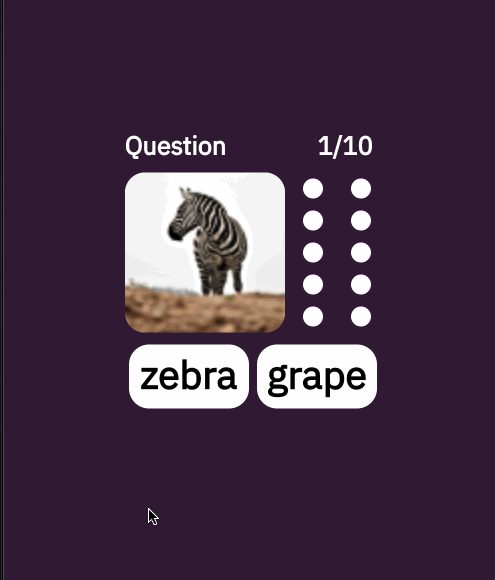

# Wordish Preview 1.0.0

---

Live Demo (ライブデモ) : https://kennyfully88.github.io/wordish_preview/

---

Study Random English Words. This is a project that shows functionality for a Flutter project. Do whatever you want with the code becasue I don't plan to update this version unless I'm fixing bugs.

---

ランダムな英語の単語を研究します。これは、フラッターの機能を示すプロジェクトです。 私がバグを修正しない限り、このバージョンを更新するつもりはないので、自分で編集したりしてもいいですよ。（大半がバグが起これば、直しますけど。）
